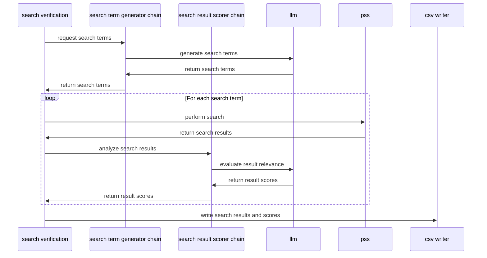

# PSS Search Verification Tool
A search vertification tool that uses AI to:
* generate a set of real-life PROA search terms
* query PSS
* evaluate relevance of search results

# Overview
## Tooling
The project uses a sequential langchain to generate search terms, query a search service and evaluate the results.

## Overview
For an overview of the approach and breakdown of the approach, feed the following prompt to GitHub Copilot:
```
Explain what the code in `search-verification/main.py` does, including the purpose of each class and method, and how the overall workflow operates.
```

## Sequence Diagram



# Local Dev Env't
## Setup
1. Clone the repository:
   ```bash
   git clone https://github.com/todd-bwell/search-verification-framework.git
   pip3 install -r requirements.txt
   ```
## Run tests

Tests are broken into unit tests and end-to-end tests. e2e tests hit the LLM and will take longer to run.

In PyCharm, right-click the tests folder and select `"Run 'Python tests in tests...'".`

Or run tests from the terminal with console logging:

`pytest --log-cli-level=INFO`

## Run `main.py` from command line

Must be in project root

`python -m search_verification.main --num_search_terms {num_search_terms} --output_file {output_file} --pss_envt {pss_envt}`

This will append output to results.csv in the `output` directory